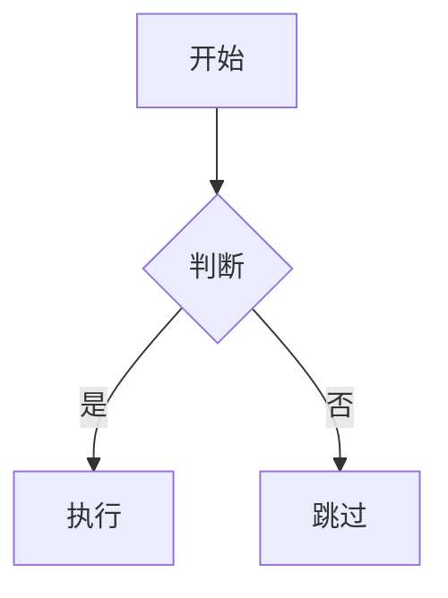

# Markdown 语法完整指南

> **📍 来源**：第2章 2.4 节「更高级的文本语法：Markdown格式」
> **📄 行号**：第 5086-5554 行
> **📖 页码**：第 XX 页

---

## 为什么选择 Markdown？

1. **数据源广泛**：GitHub、技术博客、学术论文
2. **半结构化**：平衡简洁性与功能性
3. **通用性强**：一次编写，处处可用

## 基础语法

### 标题
```markdown
# 一级标题
## 二级标题
### 三级标题
```

### 文本格式
| 效果 | 语法 |
|------|------|
| **粗体** | `**文本**` 或 `__文本__` |
| *斜体* | `*文本*` 或 `_文本_` |
| ~~删除线~~ | `~~文本~~` |
| ==高亮== | `==文本==` |

### 列表
```markdown
- 无序列表项
  - 子项目

1. 有序列表项
2. 第二项

- [ ] 未完成任务
- [x] 已完成任务
```

### 代码
```markdown
`行内代码`

```语言名称
代码块
```
```

## 高级功能

### Mermaid 流程图
````markdown

````

### 数学公式
```markdown
行内公式：$E=mc^2$

独立公式：
$$
\frac{n!}{k!(n-k)!} = \binom{n}{k}
$$
```

### 表格
```markdown
| 左对齐 | 居中对齐 | 右对齐 |
|:------|:-------:|------:|
| 内容  | 内容    | 内容  |
```

## 编辑器推荐

| 编辑器 | 特点 | 适用场景 |
|--------|------|----------|
| Typora | 所见即所得 | 日常写作 |
| VS Code | 插件丰富 | 开发者 |
| Obsidian | 知识管理 | 笔记系统 |
