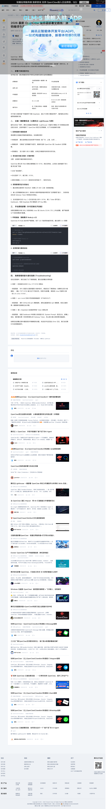
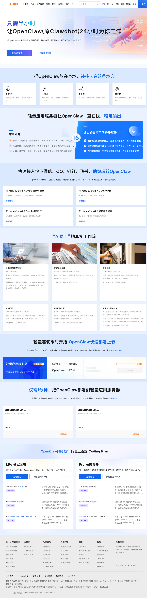
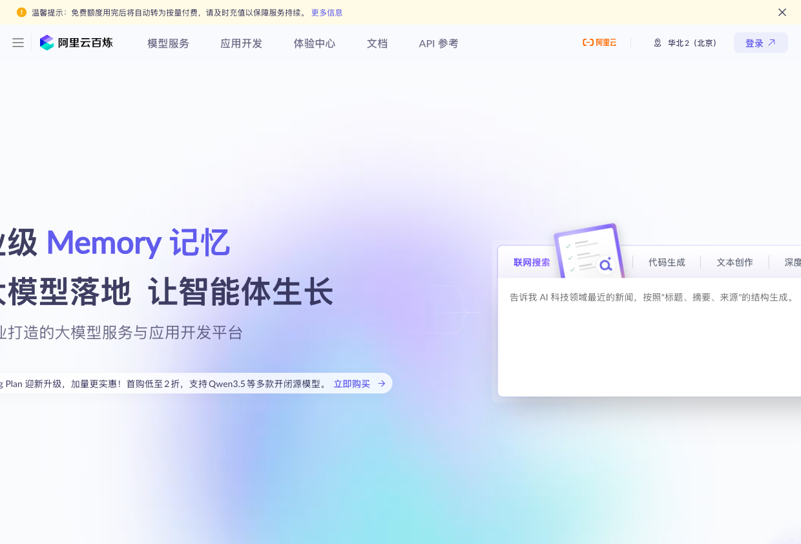
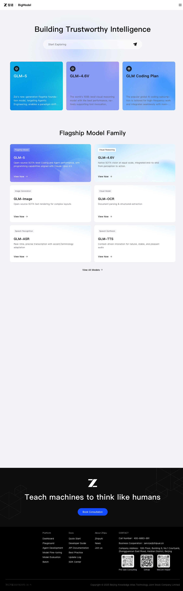
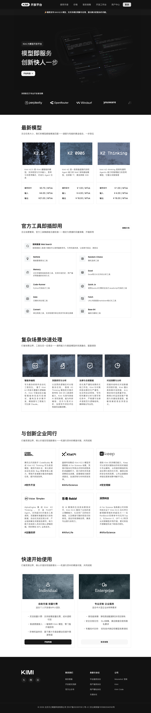
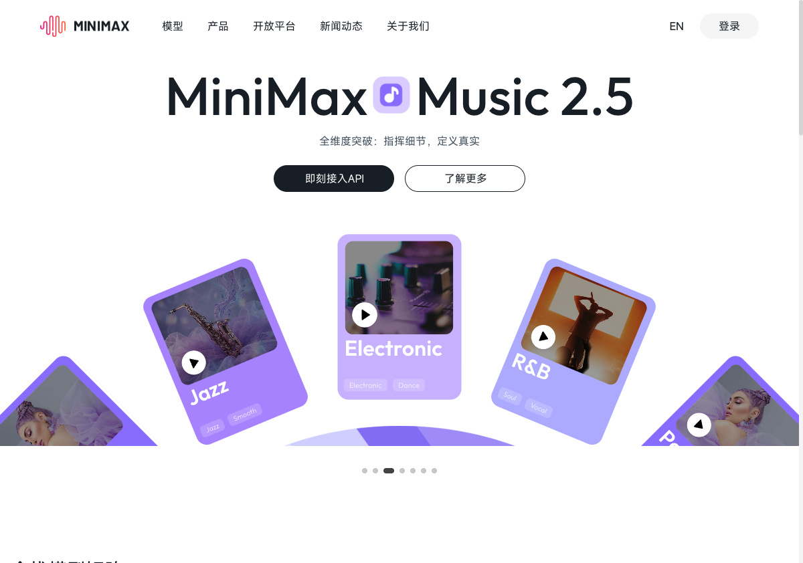
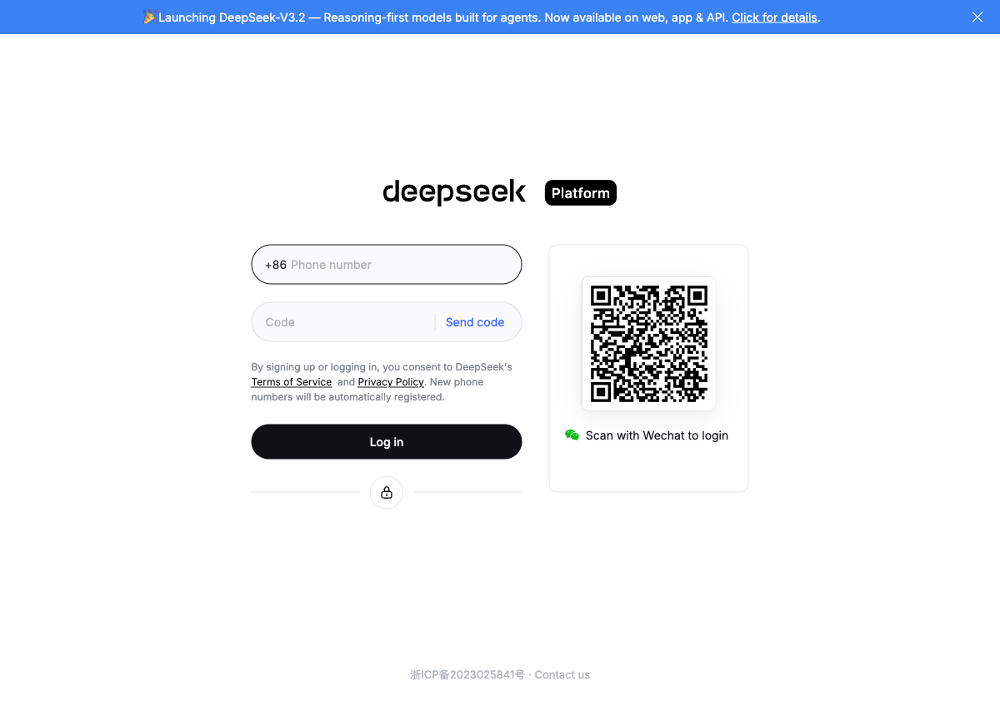
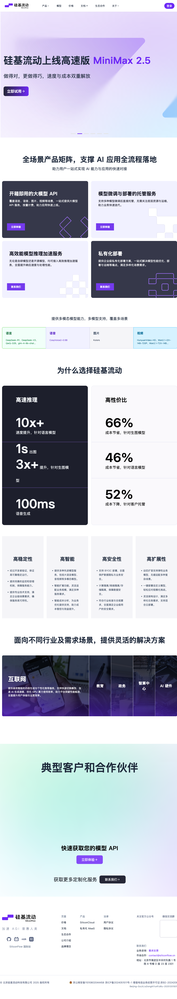

# 部署方案选型与一键配置

前面我们介绍了从命令行安装OpenClaw的方法，但对于很多普通用户来说，还有更简单的方式——**云服务器一键部署**和**家庭服务器方案**。本章将介绍多种零门槛的部署方案，以及如何快速配置各大模型API。

## 部署方案对比总览

| 方案 | 适合人群 | 成本 | 难度 | 推荐指数 |
|-----|---------|------|------|---------|
| 云服务器一键部署 | 普通用户、小团队 | 50-200元/月 | ⭐ | ⭐⭐⭐⭐⭐ |
| Mac mini家庭服务器 | 有闲置Mac的用户 | 0元（已有设备） | ⭐⭐ | ⭐⭐⭐⭐ |
| 命令行安装 | 开发者、极客 | 0元 | ⭐⭐⭐⭐ | ⭐⭐⭐ |
| Cloudflare Workers | 有前端基础的用户 | 免费额度内 | ⭐⭐⭐ | ⭐⭐⭐ |

---

## 方案一：云服务器一键部署

这是最推荐的方案。国内主流云厂商都已提供OpenClaw的**一键部署镜像**，无需任何命令行操作，10-30分钟即可完成部署。

### 1.1 腾讯云轻量应用服务器

腾讯云是最早提供OpenClaw官方镜像的云厂商之一，部署流程最成熟。

#### 步骤1：访问部署指南

访问腾讯云开发者社区的OpenClaw部署指南，获取最新的部署教程。



> 腾讯云开发者社区提供了详细的OpenClaw部署教程，包括镜像选择、端口配置等完整步骤

#### 步骤2：选择配置

| 配置项 | 推荐选择 | 说明 |
|-------|---------|------|
| 地域 | 广州/上海/北京 | 选择离你最近的地域 |
| 镜像 | 应用镜像 > AI智能体 > OpenClaw | **关键步骤** |
| 规格 | 2核4G | 基础使用足够 |
| 时长 | 按需选择 | 新用户可先选月付体验 |

#### 步骤3：放行端口

部署完成后，需要在**防火墙**中放行以下端口：

| 端口 | 用途 |
|-----|------|
| 18789 | OpenClaw Gateway |
| 80 | Web访问（可选） |
| 22 | SSH登录 |

操作路径：轻量服务器控制台 > 实例详情 > 防火墙 > 添加规则

> **提示**：在防火墙配置界面，添加TCP协议的18789端口，来源设置为0.0.0.0/0即可

#### 步骤4：访问Web界面

浏览器输入 `http://你的服务器公网IP:18789`，即可看到OpenClaw的配置界面。

**参考价格**：
- 新用户首月：约 9.9 元
- 续费价格：约 50-100 元/月

**参考链接**：[腾讯云OpenClaw一键部署指南](https://cloud.tencent.com/developer/article/2631296)

---

### 1.2 阿里云轻量应用服务器

阿里云也提供了完善的一键部署方案，并且与阿里云百炼（通义千问）深度集成。

#### 步骤1：访问专题页面

访问阿里云OpenClaw一键部署专题页面：
```
https://www.aliyun.com/activity/ecs/clawdbot
```



> 阿里云提供了OpenClaw专属一键部署方案，30分钟即可完成部署

#### 步骤2：选购配置

| 配置项 | 推荐选择 |
|-------|---------|
| 镜像 | 应用镜像 > OpenClaw（原Moltbot/Clawdbot） |
| 地域 | **海外/港澳台地域**（如香港、美国弗吉尼亚） |
| 规格 | 2vCPU + 2GiB内存 |

**为什么推荐海外地域？**
- 无需ICP备案，购买后立即可用
- 联网搜索功能不受限制
- 对接海外工具更方便

> **提示**：在阿里云购买页面，地域选择"中国香港"或"美国弗吉尼亚"等海外节点

#### 步骤3：一键放通端口

在实例详情页点击"一键放通"按钮（通常在页面顶部或右侧），系统会自动配置80和18789端口。

> **提示**：如果找不到"一键放通"，可手动进入"安全组"配置，添加TCP 18789端口的入站规则

#### 步骤4：配置百炼API-Key

1. 访问 `http://服务器公网IP:18789` 进入OpenClaw配置中心
2. 左侧导航找到"大模型配置"或"模型设置"
3. 选择"阿里云百炼"，粘贴API-Key
4. 点击"测试连接"确认配置正确

> **提示**：首次访问可能需要设置管理员密码

**参考价格**：
- 新用户首月：约 56 元起
- 包含百炼免费额度：最高7000万tokens

**参考链接**：[阿里云OpenClaw部署指南](https://developer.aliyun.com/article/1712693)

---

### 1.3 百度智能云

百度云同样提供一键部署方案，并且与文心一言深度集成。

#### 部署要点

| 配置项 | 说明 |
|-------|------|
| 服务器配置 | 2核4G内存 |
| 镜像选择 | 应用镜像 > OpenClaw |
| API配置 | 百度智能云千帆平台获取API Key |

**参考链接**：[百度云OpenClaw部署指南](https://developer.baidu.com/article/detail.html?id=5820579)

---

### 1.4 云服务器部署对比

| 云厂商 | 优势 | 劣势 | 推荐场景 |
|-------|------|------|---------|
| **腾讯云** | 部署教程完善，社区活跃 | 价格略高 | 新手首选 |
| **阿里云** | 与百炼深度集成，免费额度多 | 国内地域需备案 | 使用通义千问的用户 |
| **百度云** | 与文心一言集成 | 社区资源较少 | 百度生态用户 |
| **火山引擎** | 与豆包集成 | 价格较高 | 字节生态用户 |

---

## 方案二：Mac mini 家庭服务器

2026年，M4 Mac mini意外爆红，成为**家庭AI服务器**的首选。原因是开源AI工具OpenClaw的流行，让很多人意识到：一台闲置的Mac mini就可以7×24小时运行AI助手。

### 2.1 为什么Mac mini适合？

| 优势 | 说明 |
|-----|------|
| **低功耗** | 待机仅4W，AI服务运行时约5W |
| **静音** | 无风扇噪音，适合长期运行 |
| **统一内存** | Apple Silicon架构，适合本地模型 |
| **稳定性** | macOS系统稳定，可连续运行数月不重启 |
| **性价比** | 入门款M4 Mac mini仅4499元 |

### 2.2 硬件配置建议

| 配置 | 推荐规格 | 适用场景 |
|-----|---------|---------|
| 入门款 | M4 + 16GB + 256GB | 基础使用，云端API |
| 推荐款 | M4 + 24GB + 512GB | 本地运行7B-14B模型 |
| 进阶款 | M4 Pro + 32GB + 1TB | 本地运行32B模型 |

### 2.3 部署步骤

#### 步骤1：安装Homebrew

```bash
/bin/bash -c "$(curl -fsSL https://raw.githubusercontent.com/Homebrew/install/HEAD/install.sh)"
```

#### 步骤2：安装Node.js 22

```bash
brew install node@22
```

#### 步骤3：安装OpenClaw

```bash
curl -fsSL https://openclaw.ai/install.sh | bash
```

#### 步骤4：配置开机自启

```bash
openclaw onboard --install-daemon
```

#### 步骤5：配置远程访问（可选）

如果你想在外网访问家里的Mac mini：

**方案A：Tailscale（推荐）**

```bash
brew install tailscale
sudo tailscale up
```

**方案B：SSH隧道**

```bash
# 在Mac上
ssh -R 18789:localhost:18789 user@你的云服务器
```

### 2.4 本地模型配置

Mac mini的优势是可以运行本地模型，完全离线使用：

```bash
# 安装Ollama
brew install ollama

# 拉取模型
ollama pull qwen2.5:14b    # 14B参数模型
ollama pull llama3.2       # Llama 3.2

# 启动服务
ollama serve
```

在OpenClaw配置中使用本地模型：

```json
{
  "agents": {
    "defaults": {
      "model": { "primary": "ollama/qwen2.5:14b" }
    }
  }
}
```

---

## 方案三：模型API购买与配置

无论你选择哪种部署方案，都需要配置AI模型的API。本节介绍各大模型提供商的购买和配置方法。

### 3.1 国内模型API对比

| 提供商 | 模型 | 免费额度 | 价格参考 | 特点 |
|-------|------|---------|---------|------|
| **阿里云百炼** | 通义千问 | 7000万tokens | 39.9元/月起 | 综合最强 |
| **智谱AI** | GLM系列 | 2000万tokens | 涨价后较高 | 国产自研 |
| **月之暗面** | Kimi | 有限免费 | 49元/月 | 超长上下文 |
| **MiniMax** | M2系列 | 有限免费 | 按量计费 | 性价比高 |
| **DeepSeek** | V3/R1 | 有限免费 | 极低价格 | 推理能力强 |

### 3.2 阿里云百炼（通义千问）

**最推荐**：阿里云百炼提供最完善的国内模型服务，新用户免费额度高达7000万tokens。



#### 获取API Key步骤

1. 访问 [阿里云百炼控制台](https://bailian.console.aliyun.com/)
2. 完成实名认证
3. 点击右上角头像 > API-KEY管理
4. 点击"创建我的API-KEY"
5. 复制并保存Access Key ID和Access Key Secret

#### Coding Plan订阅

2026年2月，阿里云百炼推出Coding Plan，包含四大顶尖模型：

| 模型 | 说明 |
|-----|------|
| Qwen3.5 | 通义千问最新版 |
| GLM-5 | 智谱旗舰模型 |
| MiniMax M2.5 | MiniMax最新版 |
| Kimi K2.5 | 月之暗面最新版 |

**价格**：新用户首月39.9元，支持多模型自由切换。

#### 配置到OpenClaw

```json
{
  "env": {
    "DASHSCOPE_API_KEY": "sk-你的API-Key"
  },
  "agents": {
    "defaults": {
      "model": { "primary": "dashscope/qwen-max" }
    }
  },
  "models": {
    "providers": {
      "dashscope": {
        "baseUrl": "https://dashscope.aliyuncs.com/compatible-mode/v1",
        "apiKey": "${DASHSCOPE_API_KEY}",
        "api": "openai-completions",
        "models": [
          { "id": "qwen-max", "name": "通义千问 Max" },
          { "id": "qwen-plus", "name": "通义千问 Plus" },
          { "id": "qwen-turbo", "name": "通义千问 Turbo" }
        ]
      }
    }
  }
}
```

**参考链接**：[阿里云百炼API Key获取教程](https://developer.aliyun.com/article/1712699)

---

### 3.3 智谱AI（GLM）

智谱AI是国内自研能力最强的模型厂商之一，GLM系列模型在中文理解方面表现出色。



> 智谱AI开放平台提供GLM-5、GLM-4.6V等旗舰模型

#### 获取API Key步骤

1. 访问 [智谱AI开放平台](https://bigmodel.cn/)
2. 注册并登录
3. 点击右上角"控制台"
4. 点击"API Keys" > 添加新的API Key
5. 命名并确认创建

#### 免费额度

- **新用户**：2000万tokens永久额度（GLM-5、GLM-4.6V等）
- 免费模型**不限量供应**

#### 配置到OpenClaw

```json
{
  "env": {
    "ZHIPU_API_KEY": "你的API-Key"
  },
  "agents": {
    "defaults": {
      "model": { "primary": "zhipu/glm-5" }
    }
  },
  "models": {
    "providers": {
      "zhipu": {
        "baseUrl": "https://open.bigmodel.cn/api/paas/v4",
        "apiKey": "${ZHIPU_API_KEY}",
        "api": "openai-completions",
        "models": [
          { "id": "glm-5", "name": "GLM-5 旗舰版" },
          { "id": "glm-4.6v", "name": "GLM-4.6V 视觉版" },
          { "id": "glm-4-flash", "name": "GLM-4 Flash" }
        ]
      }
    }
  }
}
```

**参考链接**：[智谱AI API Key申请教程](https://m.sohu.com/a/988509943_122463503/)

---

### 3.4 月之暗面（Kimi）

Kimi以**超长上下文**著称，支持128K上下文窗口，非常适合处理大文档。



> Moonshot开放平台提供K2.5、K2、K2 Thinking等系列模型

#### 获取API Key步骤

1. 访问 [Moonshot开放平台](https://platform.moonshot.cn/)
2. 注册并登录
3. 进入控制台 > API Key管理
4. 创建新的API Key

#### 配置到OpenClaw

```json
{
  "env": {
    "MOONSHOT_API_KEY": "sk-你的API-Key"
  },
  "agents": {
    "defaults": {
      "model": { "primary": "moonshot/kimi-k2.5" }
    }
  },
  "models": {
    "providers": {
      "moonshot": {
        "baseUrl": "https://api.moonshot.cn/v1",
        "apiKey": "${MOONSHOT_API_KEY}",
        "api": "openai-completions",
        "models": [
          { "id": "kimi-k2.5", "name": "Kimi K2.5 最新版" },
          { "id": "kimi-k2", "name": "Kimi K2" },
          { "id": "kimi-k2-thinking", "name": "Kimi K2 Thinking 推理版" }
        ]
      }
    }
  }
}
```

---

### 3.5 MiniMax

MiniMax是2026年最受关注的AI公司之一，已登陆港股。其M2系列模型性价比极高。



> MiniMax开放平台提供M2.5等系列模型，新用户有免费额度

#### 获取API Key步骤

1. 访问 [MiniMax开放平台](https://www.minimaxi.com/)
2. 注册并登录
3. 进入控制台 > API Key管理
4. 创建API Key

> **提示**：MiniMax新用户有一定免费额度，建议先体验再决定是否付费

#### 配置到OpenClaw

```json
{
  "env": {
    "MINIMAX_API_KEY": "你的API-Key"
  },
  "agents": {
    "defaults": {
      "model": { "primary": "minimax/abab6.5s-chat" }
    }
  },
  "models": {
    "providers": {
      "minimax": {
        "baseUrl": "https://api.minimax.chat/v1",
        "apiKey": "${MINIMAX_API_KEY}",
        "api": "openai-completions",
        "models": [
          { "id": "abab6.5s-chat", "name": "MiniMax 6.5S" },
          { "id": "abab6.5g-chat", "name": "MiniMax 6.5G" }
        ]
      }
    }
  }
}
```

---

### 3.6 DeepSeek

DeepSeek以**极低的价格**和**强大的推理能力**著称，R1推理模型在复杂任务上表现出色。



#### 获取API Key步骤

1. 访问 [DeepSeek开放平台](https://platform.deepseek.com/)
2. 注册并登录
3. 进入API Keys页面
4. 创建新的API Key

#### 配置到OpenClaw

```json
{
  "env": {
    "DEEPSEEK_API_KEY": "sk-你的API-Key"
  },
  "agents": {
    "defaults": {
      "model": { "primary": "deepseek/deepseek-chat" }
    }
  },
  "models": {
    "providers": {
      "deepseek": {
        "baseUrl": "https://api.deepseek.com/v1",
        "apiKey": "${DEEPSEEK_API_KEY}",
        "api": "openai-completions",
        "models": [
          { "id": "deepseek-chat", "name": "DeepSeek Chat" },
          { "id": "deepseek-reasoner", "name": "DeepSeek R1", "reasoning": true }
        ]
      }
    }
  }
}
```

---

### 3.7 硅基流动（多模型聚合平台）

如果你不想在每个平台分别注册，可以使用**硅基流动**这样的聚合平台，一次注册即可使用多种模型。



#### 支持的模型

- 通义千问系列
- DeepSeek系列
- GLM系列
- Llama系列
- Mistral系列

#### 获取API Key步骤

1. 访问 [硅基流动](https://siliconflow.cn/)
2. 注册并登录
3. 进入控制台 > API Key管理
4. 创建API Key

#### 配置到OpenClaw

```json
{
  "env": {
    "SILICONFLOW_API_KEY": "sk-你的API-Key"
  },
  "agents": {
    "defaults": {
      "model": { "primary": "siliconflow/Qwen/Qwen2.5-72B-Instruct" }
    }
  },
  "models": {
    "providers": {
      "siliconflow": {
        "baseUrl": "https://api.siliconflow.cn/v1",
        "apiKey": "${SILICONFLOW_API_KEY}",
        "api": "openai-completions",
        "models": [
          { "id": "Qwen/Qwen2.5-72B-Instruct", "name": "通义千问 2.5 72B" },
          { "id": "deepseek-ai/DeepSeek-V3", "name": "DeepSeek V3" },
          { "id": "deepseek-ai/DeepSeek-R1", "name": "DeepSeek R1", "reasoning": true }
        ]
      }
    }
  }
}
```

---

## 方案四：Cloudflare Workers（边缘部署）

对于有前端基础的用户，可以使用Cloudflare Workers进行边缘部署，实现**零成本**运行。

### 4.1 优势

| 优势 | 说明 |
|-----|------|
| **免费额度** | 每天10万次请求免费 |
| **全球分布** | 300+城市边缘节点 |
| **无需服务器** | 不需要购买云服务器 |
| **Workers AI** | 内置Llama、Mistral等模型 |

### 4.2 部署步骤

```bash
# 安装Wrangler
npm install -g wrangler

# 登录Cloudflare
wrangler login

# 创建项目
wrangler init openclaw-worker

# 部署
wrangler deploy
```

### 4.3 局限性

- 不支持长时间运行的任务
- CPU时间限制（免费版10ms）
- 不适合完整的OpenClaw部署

**适用场景**：作为OpenClaw的Webhook接收器或轻量级代理。

---

## 部署方案选择建议

### 根据使用场景选择

| 场景 | 推荐方案 | 理由 |
|-----|---------|------|
| **完全新手** | 腾讯云一键部署 | 教程最完善，遇到问题容易找到解决方案 |
| **预算有限** | Mac mini家庭服务器 | 零额外成本，已有设备即可 |
| **需要外网访问** | 阿里云海外地域 | 无需备案，立即可用 |
| **数据敏感** | 本地部署+Ollama | 数据完全不出本地 |
| **团队协作** | 云服务器+多渠道接入 | 稳定性高，多人可同时使用 |

### 根据预算选择

| 预算 | 推荐方案 | 月成本 |
|-----|---------|-------|
| **0元** | Mac mini本地部署 | 0元 |
| **50元以下** | 腾讯云/阿里云基础套餐 | 30-50元 |
| **50-100元** | 云服务器 + Coding Plan | 70-90元 |
| **100元以上** | 高配云服务器 + 多模型 | 100-200元 |

---

## 常见问题

### Q1：云服务器和本地部署哪个好？

**答**：取决于你的需求：
- **需要7×24稳定运行** → 云服务器
- **数据隐私要求高** → 本地部署
- **预算有限** → 本地部署
- **需要外网访问** → 云服务器

### Q2：哪个模型最推荐？

**答**：根据场景选择：
- **综合最强**：通义千问 Max（阿里云百炼）
- **超长文档**：Kimi 128K
- **复杂推理**：DeepSeek R1
- **性价比**：硅基流动聚合平台

### Q3：API Key如何保护？

**答**：
1. 不要在代码中硬编码
2. 使用环境变量存储
3. 定期更换API Key
4. 设置使用额度上限
5. 监控异常调用

### Q4：如何降低成本？

**答**：
1. 使用免费额度（新用户福利）
2. 选择Coding Plan套餐（比按量付费便宜）
3. 简单任务用轻量模型，复杂任务用高性能模型
4. 配置模型回退，避免浪费

---

**本节小结**

- 云服务器一键部署是最推荐的方案，腾讯云、阿里云、百度云都提供官方镜像
- Mac mini是家庭AI服务器的最佳选择，低功耗、静音、稳定
- 国内模型API选择丰富：阿里云百炼、智谱GLM、Kimi、MiniMax、DeepSeek
- 硅基流动等聚合平台可以一次注册使用多种模型
- 根据预算和场景选择合适的部署方案和模型

---

**已获取的截图清单**

以下截图已从实际平台获取，确保真实可信：

| 序号 | 截图内容 | 文件名 | 状态 |
|-----|---------|--------|------|
| 1 | 阿里云OpenClaw专题页 | aliyun-openclaw-page.png | ✅ 已获取 |
| 2 | 腾讯云部署指南 | tencent-cloud-openclaw-guide.png | ✅ 已获取 |
| 3 | 阿里云百炼控制台 | aliyun-bailian-console.png | ✅ 已获取 |
| 4 | 智谱AI开放平台首页 | zhipu-ai-homepage.png | ✅ 已获取 |
| 5 | Moonshot开放平台 | moonshot-homepage.png | ✅ 已获取 |
| 6 | DeepSeek登录页面 | deepseek-login-page.png | ✅ 已获取 |
| 7 | 硅基流动首页 | siliconflow-homepage.png | ✅ 已获取 |
| 8 | MiniMax开放平台首页 | minimax-homepage.png | ✅ 已获取 |

**Sources:**

- [阿里云OpenClaw一键部署指南](https://developer.aliyun.com/article/1712693)
- [腾讯云OpenClaw部署全攻略](https://cloud.tencent.com/developer/article/2631296)
- [百度云OpenClaw镜像部署](https://developer.baidu.com/article/detail.html?id=5820579)
- [阿里云百炼API Key获取教程](https://developer.aliyun.com/article/1712699)
- [智谱AI API Key申请教程](https://m.sohu.com/a/988509943_122463503/)
- [2026大模型API免费额度汇总](https://cloud.tencent.com/developer/article/2626756)
- [Mac mini家庭AI服务器指南](https://post.m.smzdm.com/p/azz2odgr/)
